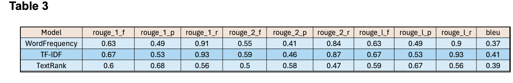

# NewsNuggets - A Comprehensive News Aggregation and Summarization Platform with Advanced Classification and Sentiment Analysis

Today's rapid information flow makes staying updated with news a formidable task. The overwhelming volume of data demands significant time to filter and often results in missed critical updates. "NewsNuggets" offers a solution by delivering swift, comprehensible summaries of news articles, sorted by topics and enhanced with sentiment analysis. This service is crafted to help users remain informed on vital news without the overload or the necessity to spend their entire day digging through extensive content. The challenge of managing vast amounts of information can lead to stress and inefficiency, highlighting the need for tools that streamline news consumption. "NewsNuggets" addresses this by ensuring users receive the most pertinent news efficiently.

## Methodology

**Data Collection:** The BBC Dataset consists of 2,225 documents collected from the BBC News website, corresponding to stories published in five topical areas during 2004-2005. It is categorized into five class labels: business, entertainment, politics, sport, and tech. The sentiment dataset consists of sentiment categories: positive and negative. The data collection aims to provide a comprehensive resource for developing and testing document clustering, classification, and other text analysis methods.

**Data Preprocessing:** 
This initial stage involves examining the data to understand its characteristics and underlying patterns. Text preprocessing is a critical component of the process, which includes several key steps: tokenization to break down text into smaller parts, removal of URLs and punctuation to clean the text, conversion of all text to lowercase to maintain consistency, and removal of stopwords to eliminate unnecessary words. Additionally, lemmatization is performed to reduce words to their base or root form, further refining the textual data. For text vectorization, techniques such as Bag of Words (BoW) and Term Frequency-Inverse Document Frequency (TF-IDF) are employed to convert text into a numerical format that can be processed by machine learning models. The data is split into training and testing sets (80-20 split). There is an imbalance in the news sentiment dataset, with most of the documents having a positive sentiment. To address this, the Synthetic Minority Over-sampling Technique (SMOTE) is applied on the training set to balance the dataset effectively.

## Model Details and Training

The details and training process for three different functionalities of the NewsNuggets application are outlined below.

**News Category Classification:** 
Based on a literature review of news category classification as a multi-class classification problem, five different models were identified and implemented: Logistic Regression, Decision Tree Classifier, Multinomial Naive Bayes, Random Forest Classifier, and AdaBoost Classifier. These models were utilized with a combination of BoW and TF-IDF vectors, resulting in a total of 10 different model configurations. Bayesian optimization was chosen for its efficiency in exploring hyperparameter spaces by considering past performance. The models were trained and validated for multiple hyperparameters.

**News Sentiment Classification:** 
News sentiment classification is similar to category classification. However, during exploratory data analysis, the positive sentiment class was found to be significantly higher than the negative sentiment class, causing an imbalance in the dataset. To address this, SMOTE is applied, increasing samples in the minority class to create a balanced dataset. Five models are selected: Logistic Regression, Decision Tree Classifier, Random Forest Classifier, AdaBoost Classifier, and Multinomial Naive Bayes Classifier. Two vectorization methods, TF-IDF and Bag of Words, are used, creating a combination of 10 distinct models. Bayesian optimization is then utilized for hyperparameter tuning to validate different hyperparameters.

**News Summarization:**
This section presents the implementation of three distinct extractive summarization techniques on the BBC News Dataset derived from the literature survey. The Word Frequency-based Summarization, TF-IDF-based Summarization, and TextRank Summarization technique represents a unique approach to the challenge of text summarization, which is critical in managing the vast amount of information generated daily.

- **Word Frequency Summarization:** This method relies on the frequency of occurrence of words within the text. Words that appear more frequently are considered more important, and sentences containing these words are selected to create the summary.
- **TF-IDF Summarization:** This technique evaluates both the frequency of words and the importance of words across documents using the Term Frequency-Inverse Document Frequency (TF-IDF) metric. It helps in identifying significant words in each document for summary generation.
- **TextRank Summarization:** Utilizing a graph-based ranking model, this method is inspired by algorithms like PageRank. It involves building a graph where sentences are nodes, and edges are based on the similarity between sentences. The ranking of each sentence determines its likelihood of inclusion in the summary.

## Experiments and Evaluation Results

**News Category Classification:**
It is crucial for efficient information retrieval and organization. To evaluate the trained models, metrics such as confusion matrix, accuracy, precision, recall, and F1-score were used. The Logistic Regression model with TF-IDF vectorization achieved a test accuracy of 98% compared to BoW.

**News Sentiment Classification:**
For model evaluation, metrics such as accuracy, precision, recall, F1-score, confusion matrix, and ROC curve are used. Logistic Regression with TF-IDF emerged as the top-performing model, achieving an impressive accuracy of 96.6%.

**News Summarization:**
The summarization models were evaluated using the ROUGE and BLEU metrics, which assess the quality of text summaries by comparing them to reference summaries. The TF-IDF model consistently outperformed the other two models across almost all metrics, indicating a superior ability to generate summaries that align closely with the reference texts.

## Deployment

As part of the deployment process, the best classification and summarization models have been integrated into the “NewsNuggets” application. This application enables users to input news articles, which are then preprocessed, vectorized, and analyzed to provide results that are categorized, sentiment-analyzed, and summarized. For the user interface, HTML5 and CSS were employed to create a responsive and intuitive design, and the backend functionality was managed through a Flask application server.

## Discussion

At "NewsNuggets," we tackled the problem of information overload in digital news by creating a platform that organizes, analyzes emotions, and summarizes news efficiently using advanced natural language processing and machine learning techniques. We fine-tuned our systems with methods like ensemble learning and Bayesian optimization, achieving standout results with our Logistic Regression model with category classification and sentiment classification that uses TF-IDF vectorization—reaching a test accuracy of 98%, 96% respectively, and excellent scores in precision, recall, and F1 metrics. The TF-IDF summarization technique was particularly effective, capturing essential content as shown by its high scores in ROUGE-1 F1 Score is 0.67. Overall, "NewsNuggets'' has greatly improved the user experience by providing quick and relevant news summaries, making it an essential tool in today's fast-paced digital world.

## Future Improvements

- Enhance accessibility by offering content in multiple languages, using automatic translation and collaborative tools for accuracy.
- Empower users with machine learning-driven personalized content recommendations and customizable preferences for increased engagement.
- Focus on improving infrastructure to efficiently manage higher traffic and data volumes, ensuring seamless scalability as user demand grows.
- The application can be enhanced by incorporating advanced summarization models. Additionally, it can be integrated with personalized news summaries tailored to individual user preferences, improving the overall user experience and relevance of the content.
- Future enhancements could focus on domain-specific sentiment analysis, such as finance-related news, allowing financial institutions and analysts to gain deeper insights and make more informed decisions.

## Dataset Source

- [BBC News Dataset](http://mlg.ucd.ie/datasets/bbc.html)
- [News Sentiment Dataset](https://www.kaggle.com/datasets/hoshi7/news-sentiment-dataset)
